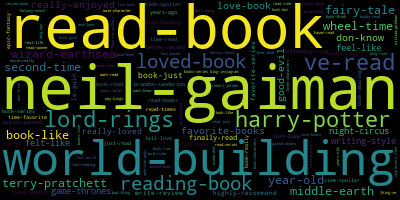
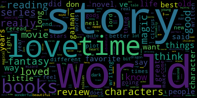
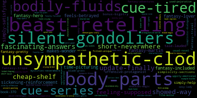
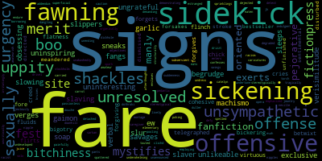
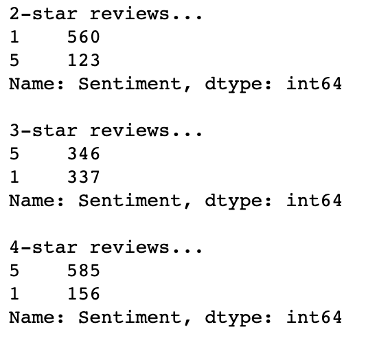
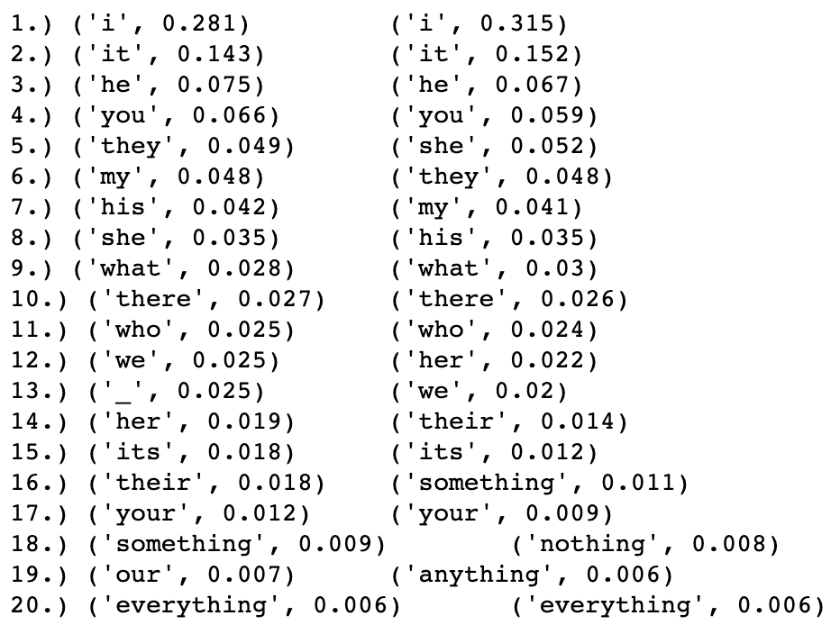
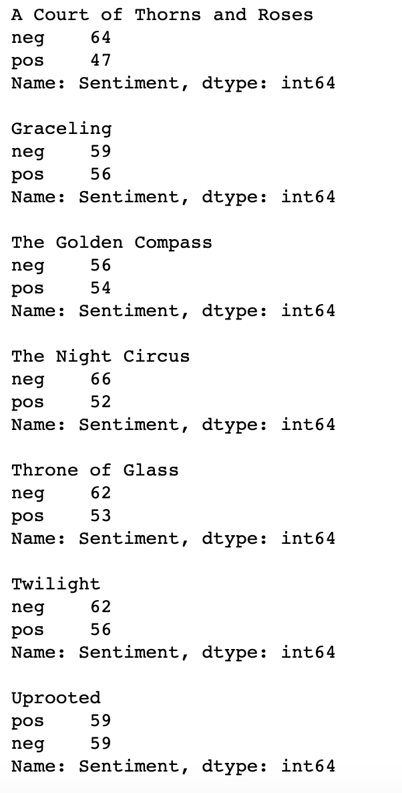
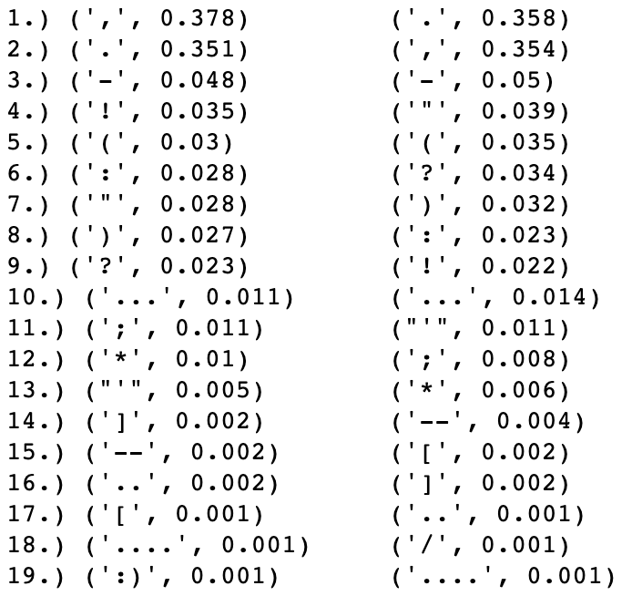
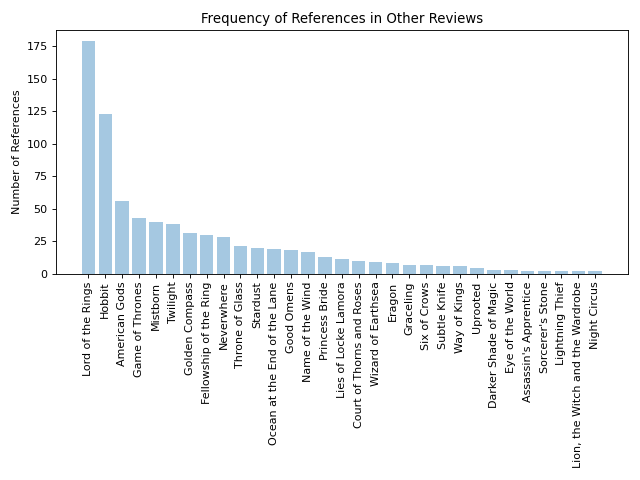
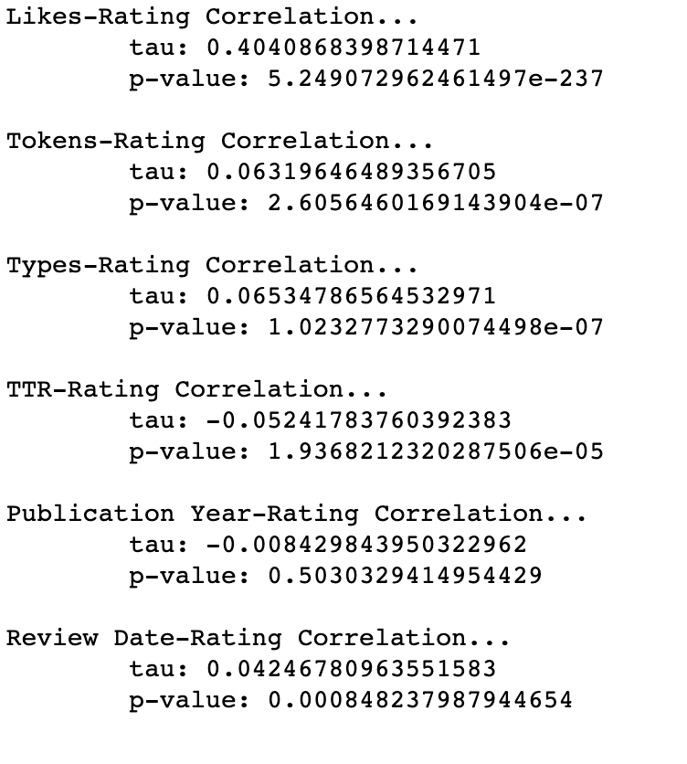

Michael Barmada MDB120@pitt.edu
2 May 2021

# Final Report

## Table of Contents...
* [Introduction](#Introduction)
	* [Goodreads](#Goodreads)
	* [Problems](#Problems)
	* [Final Data](#Final-Data)
* [Building Classifiers](#Building-Classifiers)
 	* [By Rating](#By-Rating)
	* [Binary Classification](#Binary-Classification)
	* [Feature Weights (WordClouds)](#Feature-Weights)
* [Specific Lexical Analysis](#Specific-Lexical-Analysis)
	* [Third-Person Pronoun Use](#Third-Person-Pronoun-Use)
	* [Other Features](#Other-Features)
	* [Titular Analysis](#Titular-Analysis)
* [Non-Lexical Data](#Non-Lexical-Data)
* [Conclusion](#Conclusion)

## Introduction

While trying to come up with an idea for this project, I started looking around the internet for some inspiration. I had started reading more often during the pandemic and was really into sci-fi/fantasy at the time, so I was looking for something along those lines when I found [100 years of scifi](https://openmappr.com/play/100YrsOfSciFi). This very complicated project involved scraping goodreads reviews for data on sci-fi books that was then used to build a cluster network that links books together based on common keywords.

This seemed immediately too ambitious for how little I understood about data science and webscraping, but I was drawn to the idea of using goodreads reviews as a basis for my analysis. Thus, I decided I would perform some sentiment analysis on goodreads reviews, focusing specifically on the fantasy side of sci-fi/fantasy to keep things interesting. 

I ended up getting a bit distracted along the way, but the main goal of this analysis was to find out what linguistically differentiates positive and negative Goodreads reviews in the fantasy genre. For this I had some preliminary hypothesis...

* Overall, 3-star reviews will skew more positive (they are awkwardly in the middle and the books were all popular and well-received)
* More positive reviews will receive more likes (for the same reasons)
* Negative reviews will use more first-person pronouns (negative reviews may tend to focus on personal experience over objective critique)

Before I could get to these, however, I had to collect my data –a process that proved to be a project unto itself. 

### Goodreads
Reviews were scraped from goodreads.com, a website for readers to review the books they've read and share those reviews with others. It combines many elements of an audience review site (e.g. metacritic) with those of a social media platform, meaning that users can “like” reviews and follow other users to see what they have been reading.

Goodreads also allows users to place books in certain "shelves", a user-driven way of classifying similar books without relying on a fixed set of established keywords. For the purpose of this analysis, I decided to use the Fantasy shelf, which contains links to the top 100,000 books most often shelved as fantasy by users.

### Problems
Immediately, I ran into a problem as the fantasy shelf includes multiple books from a series. For instance, the top 10 books are almost all Harry Potter. In order to get a better spread of the fantasy genre I decided to exclude everything but the first book in a series. I used a small piece of regex to filter out the offending book titles while scraping this page for URLs and ended up with 32 good URLs. 
The other main issue I encountered was with ajax requests. Where most buttons on a website load a new page with new information, Goodreads’ review panel uses ajax requests to seamlessly update the reviews that it displays without having to refresh the page. From a design standpoint, this is quite nice (when it works), but it makes scraping incredibly difficult as there are no URLs for a spider to follow. Furthermore, the buttons must be manually clicked from a web browser, which a spider is unable to do. To solve this, I had to set up and program a web driver that could open Goodreads in my browser and push each button for me. This was made even more difficult by the inconsistency of ajax requests on Goodreads.com. Sometimes the page would update instantaneously, but other times it took upwards of 15 seconds to load the next page of reviews. 

A book's page only shows the 30 most popular reviews at once and only allows access to 10 pages in total. In effect, this means you can only see the top 300 reviews by default. In the first iteration of my code, I looped through these pages until I had enough data. However, since I wanted roughly equal data from each review level (1-star, 2-star, etcetera), and since these books are all very positively reviewed, I had to loop through each of the 10 pages to find enough low-score reviews. Even then I sometimes couldn’t get the 10 reviews per level that I was aiming for then. As such, I decided to alter my code so that, instead of looping through the 300 most-popular reviews, I used the filter system to isolate reviews based on their rating. This came with both pros and cons. The pros were that I could now scrape significantly more data in significantly less time. With a filter applied, I could scrape all 30 reviews off the page at once, getting up to 150 reviews per book in a fraction of the time (I ended up going with 120 in case there were any issues). The biggest con was that Goodreads only allows for one filter to be in place at a time, which unfortunately includes language filters. Because of this, I had to filter out the non-English reviews myself after scraping, which eliminated a bit of my data.

### Final data
In the end, I found myself with 3,549 reviews from 32 titles. For each book, I had recorded its title, year of publication, and genre tags while each individual review had saved its full text, score, number of likes, and associated shelves (if any) as well as the date of that review’s publication. After some cleanup, I also added a column each review’s text saved as a SpaCy object, and from that I extracted token counts, types, and type-to-token ratio for each review. 

## Building Classifiers
### By Rating
Going into the analysis, I intended to split the data between positive and negative reviews, but first, I wanted to see how well I could predict review score using just lexical data.  Because review score can be treated as either continuous or categorical (ordinal) data, I decided to try out two estimators: a multinomial naïve-bayes classifier and a linear regressor. Despite a bit of hyperparameter tuning, I could not get the classifier above 60% accuracy. For a classifier predicting a variable of 5 categories, that isn’t too bad but it also isn’t ideal. 

	Confusion matrix for MultinomialNB

As we can see, the classifier excels at 4 and 5-star reviews, but does a lot worse at the other end, especially with 2-star reviews. These, it seems to mistake for 1-star reviews quite often. There is also generally a bit of confusion between 4 and 5-star reviews as well as, interestingly, a lot of ambiguity with 3-star reviews. The classifier seems to be unsure about what distinguishes them from 2 and 4-star reviews.
The regressor, unfortunately, did not do much better. It was only about 55 percent accurate, and its mean squared error was about 0.95.

### Binary Classification
Thankfully, binary classification went much better. For this, I assumed that 1 and 5-star reviews would be overwhelmingly negative and positive, respectfully. I therefore split my data set in two, taking out the mid-score reviews and using the ends to train a binary classifier. I tried out multiple different models for this (including multinomial naïve bayes and logistic regression) but the classifier with the highest accuracy was achieved using truncated singular value decomposition (TruncatedSVD) and a linear support vector classifier (LinearSVC). 

	Confusion Matrix for LinearSVC model

This classifier reached an accuracy of 91.7 percent, just edging out the MultinomialNB (89.6) and LogisticRegression (89.3) models. Interestingly, as can be seen with this confusion matrix for the SVC model, all of them seem to have a slight positive bias (note that in this matrix 5 = positive and 1 = negative). 

### Feature Weights
Unfortunately, using a dimensionality reduction technique like TruncatedSVD made it impossible to extract meaningful feature weights from the LinearSVC model, so we’ll look at the ones from the naive bayes classifier instead…

	Positive Wordcloud

	Negative Wordcloud

It seems that bigrams dominate the negative features while unigrams carry more positive weight. These wordclouds are a little convoluted, however, let's split them up by unigrams and bigrams...

	Positive Bigram Wordlcoud

	Positive Unigram Wordcloud

	Negative Bigram Wordlcoud

	Negative Unigram Wordcloud

Things seem pretty straightforward here, except for the negative bigrams. These are a bit specific (though I can see why retellings of beauty and the beast might be unpopular). Most of the positive bigrams are quite specific as well, but most of those at least make reference to other books or authors.

Once I had my classifier trained, I used it to predict the sentiment of the mid-score data and combined the two pieces back into one dataframe. 

	Sentiment by Rating

Looking at sentiment compared to rating, it seemed that positive and negative reviews were fairly evenly spread. 4-star reviews were mostly positive, 2-star reviews mostly negative, and 3-star reviews were almost evenly split. From there, I started dig into the specific linguistic data using SpaCy.

## Specific Lexical Analysis

The first thing I looked at was part of speech frequency. However, the two were almost identical across the board. After that, I moved on to pronoun usage. 

	Most Common Pronouns (Left: Positive, Right: Negative)

This list specifically looks at lemmas so as to eliminate subject/object differences. What stands out on this list is that, while 'I' dominates in all reviews, it is a good bit more frequent in negative reviews. This is a relatively small difference, but it supports our hypothesis that negative reviews use more first-person pronouns. 

What's potentially more interesting is that third-person fememine pronouns are a good bit more frequent in negative reviews while masculine reviews are conversely dominant in positive reviews. This hints at a degree of bias in goodreads reviews, and warrants some further investigation.

### Third-Person Pronoun Use
Based on the incongruence in gendered pronouns, I hypothesized that books with female protagonists (or a largely-female cast) would generally be reviewed negatively. Unfortunately, this was quite difficult to test as none of my data included information on a book's protagonist. Instead, I found which books had more feminine than masculine third person pronouns and assumed that these would be books with a primarily female cast. Thankfully, the list was quite small, so I was able to verify myself that they all followed female protagonists. 

Indeed, with the exception of the golden compass, all of these books had more negative than positive reviews. My next thought was to look at genre to see if that could account for this bias instead.

Most of these books are tagged either as "young adult" or "romance". This complicates the analysis, as both of these subgenres typically feature female protagonists and both of them are frequently looked down upon and belittled (less-so nowadays, but still). There may be a degree of misogyny behind these attitudes, but it is difficult to tell if it's the presence of female characters that is causing the negative skew or just the subgenre itself. Likely it is both, but we've reached the end of what we can study with our data set, at least where gendered pronouns are concerned.

### Other Features
Two other lexical categories that I looked at between positive and negative reviews were interjections and punctuation. Interjections didn't bring up anything too interesting, but differences in puncutation were quite telling. 

	(Left: Positive, Right: Negative)

Right away, we see that comas are more common than periods in positive reviews. This perhaps suggests the presence of more run-on sentences, or that sentences in positive reviews are just longer overall. This might be reflective of the enthousiasm of most positive reviews. After all, proper sentence structure often takes a back seat when people are gushing about a book they love.

In a similar vein, exclamation points are much more frequent in positive reviews. Question marks, however, predominate in the negative reviews. Looking at some sentences with question marks from such reviews, most seem to be sarcastic or at least rhetorical. Here are some highlights...

"I should lighten up, right?"

"So whats this book all this about then?"

"Like where was the fucking action ?"

"No??"

### Titular Analysis
This part of the analysis was a bit of a detour. I wanted to see how often each book was mentioned in reviews of another book. This had a few problems to work of its own (namely the fact that people frequntly drop the leading determiner of a book's title), but in the end I managed to get some accurate counts

It should come as no surprise that Tolkien's works are at the top of the list, but what's interesting is that something like American Gods is more frequently referenced than a Game of Thrones, especially considering the latter's cultural significance. 

My best explanation for this is that a Game of Thrones has a handy, widely-used acronym (aGoT or just GoT) for use in discussions. American Gods, however, does not. This is an issue with a lot of these books, as acronyms are especially common in fantasy discussions (lotr, asoiaf, wot, hp, etcetera). It should be possible to automate a way of acronymizing all of these titles, but I unfortunately did not have the time to work that out.

## Non-Lexical Data

For non-lexical data, I had six main categories: tokens, types, ttr, date of publication, date of review, and total likes. I ran kendall's tau tests to see how well each of these correlated with rating.

As we predicted, likes and rating are fairly strongly correlated. Everything else is a bit weaker, but the only insignificant correlation is between publication year and rating, which seemed the least likely to be correlated anyways. Date of review is also only weakly correlated which makes sense. 

As expected, these weak correlations didn't make for particularly accurate estimators. For classification, I tried using principal components analysis and a K-Nearest Neighbors classifier, but I got a maximum accuracy of only about 33 percent.

## Conclusion

There were some noteable lingusitic differences in positive and negative goodreads reviews in the fantasy genre. I was able to test my hypotheses and found that, although 3-star reviews ended up very balanced, likes and rating did end up being positively correlated and first-person pronouns did show up more frequently in negative reviews (if only a little). I was also able to take this analysis one step further, looking at differences in gendered pronouns between positive and negative reviews. Although I was not able to make any definitve conclusions, there seems to be some gender bias in goodreads reviews.

This project was incredibly fun, and a very profound learning experience. I learned a lot about how to apply these concepts to real-world data and, perhaps more importantly, how to actually get that data. I honestly wish I had more time to flesh out some parts of the analysis, but in the end I had to stop somewhere or else this report would (somehow) end up even longer than it already is.