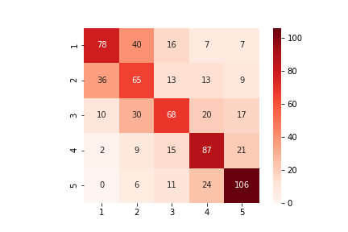
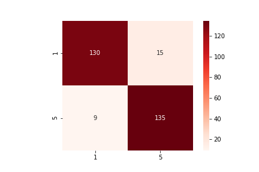
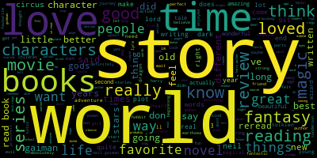
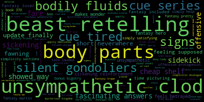

Michael Barmada MDB120@pitt.edu
2 May 2021

# Final Report

The goal of this analysis was to find out what linguistically differentiates positive and negative Goodreads reviews in the fantasy genre. However, the process of collecting the data necessary to perform such an analysis proved to be a project unto itself. 

Reviews were scraped from goodreads.com, a website for readers to review the books they've read and share those reviews with others. It combines many elements of an audience review site (e.g. metacritic) with those of a social media platform, meaning that users can “like” reviews and follow other users to see what they have been reading.

Goodreads also allows users to place books in certain "shelves", a user-driven way of classifying similar books without relying on a fixed set of established keywords. For the purpose of this analysis, I decided to use the Fantasy shelf, which contains links to the top 100,000 books most often shelved as fantasy by users.

Immediately, I ran into a problem as the fantasy shelf includes multiple books from a series. For instance, the top 10 books are almost all Harry Potter. In order to get a better spread of the fantasy genre I decided to exclude everything but the first book in a series. I used a small piece of regex to filter out the offending book titles while scraping this page for URLs and ended up with 32 good URLs. 
The other main issue I encountered was with ajax requests. Where most buttons on a website load a new page with new information, Goodreads’ review panel uses ajax requests to seamlessly update the reviews that it displays without having to refresh the page. From a design standpoint, this is quite nice (when it works), but it makes scraping incredibly difficult as there are no URLs for a spider to follow. Furthermore, the buttons must be manually clicked from a web browser, which a spider is unable to do. To solve this, I had to set up and program a web driver that could open Goodreads in my browser and push each button for me. This was made even more difficult by the inconsistency of ajax requests on Goodreads.com. Sometimes the page would update instantaneously, but other times it took upwards of 15 seconds to load the next page of reviews. 

A book's page only shows the 30 most popular reviews at once and only allows access to 10 pages in total. In effect, this means you can only see the top 300 reviews by default. In the first iteration of my code, I looped through these pages until I had enough data. However, since I wanted roughly equal data from each review level (1-star, 2-star, etcetera), and since these books are all very positively reviewed, I had to loop through each of the 10 pages to find enough low-score reviews. Even then I sometimes couldn’t get the 10 reviews per level that I was aiming for then. As such, I decided to alter my code so that, instead of looping through the 300 most-popular reviews, I used the filter system to isolate reviews based on their rating. This came with both pros and cons. The pros were that I could now scrape significantly more data in significantly less time. With a filter applied, I could scrape all 30 reviews off the page at once, getting up to 150 reviews per book in a fraction of the time (I ended up going with 120 in case there were any issues). The biggest con was that Goodreads only allows for one filter to be in place at a time, which unfortunately includes language filters. Because of this, I had to filter out the non-English reviews myself after scraping, which eliminated a bit of my data.

In the end, I found myself with 3,549 reviews from 32 titles. For each book, I had recorded its title, year of publication, and genre tags while each individual review had saved its full text, score, number of likes, and associated shelves (if any) as well as the date of that review’s publication. After some cleanup, I also added a column each review’s text saved as a SpaCy object, and from that I extracted token counts, types, and type-to-token ratio for each review. 

Going into the analysis, I intended to split the data between positive and negative reviews, but first, I wanted to see how well I could predict review score using just lexical data.  Because review score can be treated as either continuous or categorical (ordinal) data, I decided to try out two estimators: a multinomial naïve-bayes classifier and a linear regressor. Despite a bit of hyperparameter tuning, I could not get the classifier above 60% accuracy. For a classifier predicting a variable of 5 categories, that isn’t too bad but it also isn’t ideal. 

As we can see, the classifier excels at 4 and 5-star reviews, but does a lot worse at the other end, especially with 2-star reviews. These, it seems to mistake for 1-star reviews quite often. There is also generally a bit of confusion between 4 and 5-star reviews as well as, interestingly, a lot of ambiguity with 3-star reviews. The classifier seems to be unsure about what distinguishes them from 2 and 4-star reviews.
The regressor, unfortunately, did not do much better. It was only about 55 percent accurate, and its mean squared error was about 0.95.

Thankfully, binary classification went much better. For this, I assumed that 1 and 5-star reviews would be overwhelmingly negative and positive, respectfully. I therefore split my data set in two, taking out the mid-score reviews and using the ends to train a binary classifier. I tried out multiple different models for this (including multinomial naïve bayes and logistic regression) but the classifier with the highest accuracy was achieved using truncated singular value decomposition (TruncatedSVD) and a linear support vector classifier (LinearSVC). 

This reached an accuracy of 91.7 percent, just edging out the MultinomialNB (89.6) and LogisticRegression (89.3) models. Interestingly, as can be seen with this confusion matrix for the SVC model, all of them seem to have a slight positive bias (note that in this matrix 5 = positive and 1 = negative). 

Unfortunately, using a dimensionality reduction technique like TruncatedSVD made it impossible to extract meaningful feature weights from the LinearSVC model, so we’ll look at the ones from the logistic regressor instead…

	Positive

	Negative

